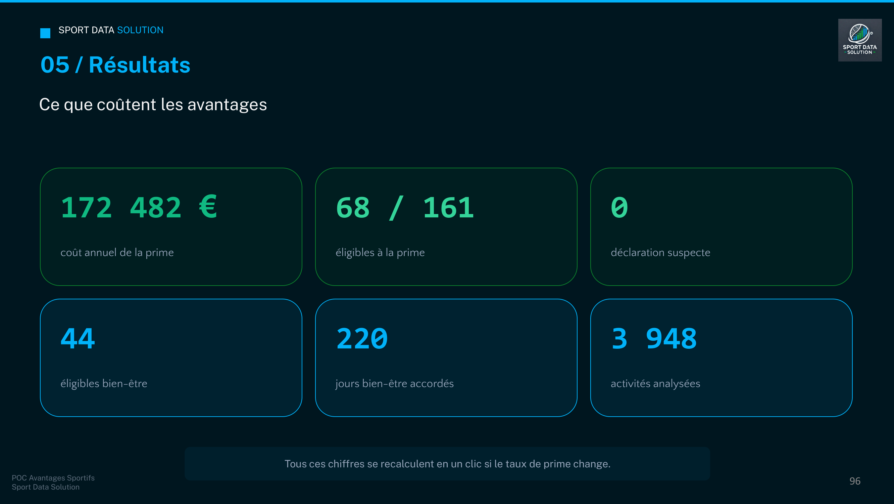
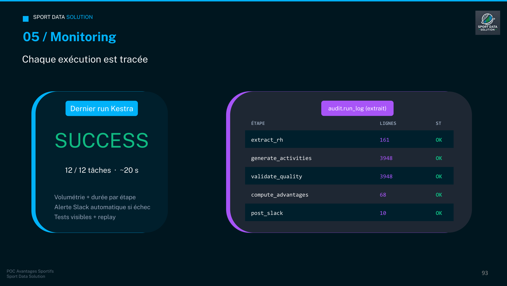

# POC Avantages Sportifs — Sport Data Solution (P12)

> Pipeline ETL bout-en-bout calculant l'impact financier de deux avantages
> sportifs pour les salariés de Sport Data Solution (entreprise fictive).
> Projet OpenClassrooms P12 — Data Engineer — **Option B**.

🔗 **Dépôt GitHub** : https://github.com/MoyLiG/P12_projet_infrastructure

---

## Prérequis & environnement

**Contrat d'exécution (le seul prérequis pour faire tourner le POC) : Docker.**
Toute la stack (Kestra, PostgreSQL, le pipeline Python) tourne en conteneurs.
N'importe quel OS muni de Docker + un shell exécute le projet à l'identique —
c'est ce qui garantit la reproductibilité.

- **Docker Desktop** (ou Docker Engine) avec `docker compose` v2
- Un shell POSIX pour les commandes ci-dessous (bash, WSL, Git Bash, macOS/Linux)

**Environnement de dev recommandé : WSL2 / Linux.** Tout ce qui s'exécute *hors
conteneur* — tests `pytest`, scripts `src/`, génération de données — repose sur
une stack Python Linux-first (pandas, SQLAlchemy, Faker, Great Expectations).
Lancer ces outils depuis un shell Linux aligne le poste de dev sur les conteneurs
et évite les pièges Windows (chemins, fins de ligne CRLF, encodages, deps natives
type `psycopg`).

```bash
# venv créé côté Linux/WSL pour le dev hors conteneur
python3 -m venv .venv
source .venv/bin/activate
pip install -r requirements.txt
pytest
```

> Windows pur (PowerShell) suffit pour piloter Docker, mais pour développer/tester
> hors conteneur, passe par WSL2.

**VSCode (WSL)** : après création du venv, sélectionne l'interpréteur du projet
via `Ctrl+Shift+P` → **Python: Select Interpreter** → `./.venv/bin/python`. Les
terminaux intégrés activeront alors le venv automatiquement (préfixe `(.venv)`).

---

## Quick start

```bash
# 1. Copier le template d'environnement et remplir les secrets
cp .env.example .env
# editer .env : GOOGLE_MAPS_API_KEY, SLACK_WEBHOOK_URL, mots de passe

# 2. Démarrer la stack
docker compose up -d --build
#    Postgres   -> localhost:5432
#    Kestra UI  -> http://localhost:8080

# 3. Le flow Kestra s'importe automatiquement (~10 s).
#    Lancer une exécution :
#    - UI : Flows -> company.sport_data.sport_advantages_etl -> Execute
#    - CLI :
curl -X POST http://localhost:8080/api/v1/executions/company.sport_data/sport_advantages_etl
```

**Reset complet** :
```bash
docker compose down -v && docker compose up -d --build
```

---

## Architecture

Pipeline orchestré par Kestra. Données stockées en PostgreSQL avec trois schémas
séparés (`raw` / `staging` / `marts`) inspirés du pattern dbt, plus `audit` pour
le monitoring et `cache` pour les distances Google Maps.

```
   XLSX RH +              ┌──────────┐   GE suite    ┌────────────┐
   sportives    ──► raw ──►          ├──► validate ──►  marts     │──► PowerBI
                          │ staging  │   géo + qual  │ eligibility│
   Strava-like  ──────────►          │               │ KPI        │──► Slack
   (générées)              └──────────┘               └────────────┘
                                │                          │
                                ▼                          ▼
                          audit.run_log              audit.eligibility_changes
```

Détail des choix techniques : voir `docs/data_dictionary.md` (dictionnaire de
données). Le rapport projet complet est remis sur OpenClassrooms (non versionné ici).

---

## Résultats



Sur les **161 salariés** du jeu RH et **3 948 activités** analysées :

| | Valeur |
|---|---|
| Coût annuel de la prime | **172 482 €** |
| Éligibles à la prime | **68 / 161** |
| Éligibles bien-être | **44** |
| Jours bien-être accordés | **220** |
| Déclarations suspectes | **0** |

Tous ces chiffres se recalculent en une exécution si le taux de prime change —
c'est l'intérêt d'avoir la règle dans le pipeline plutôt que dans un tableur.

### Traçabilité des exécutions



Chaque exécution écrit dans `audit.run_log` : volumétrie et durée par étape,
statut, `run_id`. Un échec déclenche une alerte Slack, et le run reste rejouable
depuis l'interface Kestra.

---

## Données simulées (façon API Strava)

La note de cadrage demande de « créer automatiquement des données comme l'API
Strava ». En attendant un branchement réel sur Strava (phase finale), le
générateur produit dans **`raw.activities`** un payload JSON fidèle au modèle
d'une activité Strava (`id`, `athlete`, `moving_time` ≠ `elapsed_time`,
`start_date` / `start_date_local`…). Une étape d'ingestion
(`src/transform/activities.py`) **aplatit** ensuite ce JSON vers le schéma
métier imposé `staging.activities`.

| Champ API Strava | Colonne `staging.activities` |
|---|---|
| `id` | `source_activity_id` (lignage) |
| `athlete.id` | `id_employee` |
| `start_date` | `start_dt` |
| `start_date` + `elapsed_time` | `end_dt` |
| `name` | `sport_type` (libellé FR) |
| `distance` | `distance_m` (NULL si non pertinent) |
| `moving_time` | `moving_time_s` |
| `comment` | `comment` |

Champs Strava riches (kudos, polyline, watts, fréquence cardiaque) **non
simulés** : principe de minimisation des données (RGPD). Échantillon complet du
contrat : `data/sample_strava_activity.json`. Le jour d'un branchement live,
seule l'alimentation de `raw.activities` change — l'aplatissement et tout
l'aval restent identiques.

---

## Stack

| Brique | Outil | Pourquoi |
|---|---|---|
| Orchestration | Kestra 0.19 | Flow YAML versionné, replay natif, monitoring UI |
| BDD | PostgreSQL 16 | Rôles, RLS, audit triggers — adapté aux PII RH |
| Langage | Python 3.11 | pandas / SQLAlchemy / Faker / GE |
| Qualité | Great Expectations | Suite déclarative, docs HTML, intégration Kestra |
| Géo | Google Maps Distance Matrix + fallback haversine | Réel en démo, cache PG |
| Notifications | Slack Incoming Webhook | Démo live crédible |
| Restitution | PowerBI Desktop | Connecteur PG natif, paramètres dynamiques |

---

## Sécurité

- `.env` jamais versionné — `.env.example` contient des placeholders.
- 3 rôles PG : `etl_writer` (R/W pipeline), `analyst_reader` / `powerbi_reader`
  (read marts only — **pas d'accès aux PII**).
- Pseudonymisation : les analystes voient `hash(nom+prénom+salt)` (via
  `employees_safe`), jamais les noms.
- Vues RH (prime / bien-être) : seul identifiant exposé = `id_salarie`
  (ID salarié RH), un pseudonyme interne ré-identifiable par le seul service RH
  via la table de correspondance source — nécessaire au versement des primes et
  à l'octroi des jours bien-être. Pas de hash redondant, nom/prénom/salaire exact
  restent hors BI (minimisation RGPD).
- Row Level Security activée sur `staging.employees`.
- Triggers d'audit sur `marts.eligibility_*` → `audit.eligibility_changes`.
- Inserts SQL paramétrés (SQLAlchemy) — pas de string formatting.

### Le cycle de vie d'une donnée RH


La même donnée, trois niveaux d'exposition. `etl_writer` écrit sur toute la
chaîne — c'est lui qui alimente la couche de restitution ; `analyst_reader` et
`powerbi_reader` ne lisent que `marts`, qui ne contient **aucune PII**. Concrètement,
`Le Gall · 42 000 € · Lattes` devient `a3f9c2… · BU Tech · 40-50 k€` côté BI.

---

## Industrialisation

**Déjà en place :**

- **Reproductible** — stack conteneurisée, démarrage en une commande.
- **Idempotent** — rejouable sans doublons (Slack, calculs).
- **Observable** — tests visibles, alerte Slack, rapport Great Expectations exporté.

**Prochaines étapes pour un passage en production :**

- **API Strava réelle** — remplacer le générateur par les vraies données.
- **CI/CD** — tests et audit de sécurité à chaque commit.
- **Secret manager** — rotation des secrets en production.

---

## Structure du repo

```
P12/
├── flows/                Flow YAML Kestra
├── sql/                  Init DB (auto-exécuté au démarrage Postgres)
├── src/                  Pipeline Python (extract / generate / validate / transform / load)
├── tests/                Tests pytest
├── powerbi/              Dashboard .pbix
├── docs/                 data_dictionary.md (dictionnaire de données)
├── scripts/              bootstrap.sh, demo.sh
├── data/                 raw/ (XLSX, git-ignored) + generated/ (CSV)
├── docker-compose.yml
├── requirements.txt      Dépendances Python (dev hors conteneur)
└── README.md             ← ce fichier
```

---

## Livrables OpenClassrooms

Le **rapport projet** est remis directement sur la plateforme OpenClassrooms —
il n'est pas versionné ici.

Présents dans le repo :
- `docs/Le_Gall_Morgan_Option_B_1_support_062026.pdf` — support de soutenance
  (116 pages, rendu directement par GitHub)
- `Le_Gall_Morgan_Option_B_3_lien_062026.txt` — URL de ce dépôt GitHub
- `powerbi/Le_Gall_Morgan_Option_B_2_pbix_062026.pbix` — dashboard PowerBI
- `docs/data_dictionary.md` — dictionnaire de données
